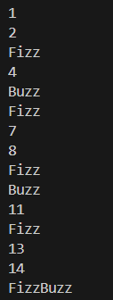

# Task

A simple but flexible implementation of the classic **FizzBuzz** problem in Python.  
- Multiples of 3 → `"Fizz"`  
- Multiples of 5 → `"Buzz"`  
- Multiples of both 3 and 5 → `"FizzBuzz"`  
- Otherwise → the number itself 

# Install Environment 
```bash
pip install python
pip install pytest 
```

# Run application
```bash
python fizzbuzz.py
```

# Run tests 
```bash
python -m pytest
```

# Generated Output
Here’s what the output looks like when running the program:




